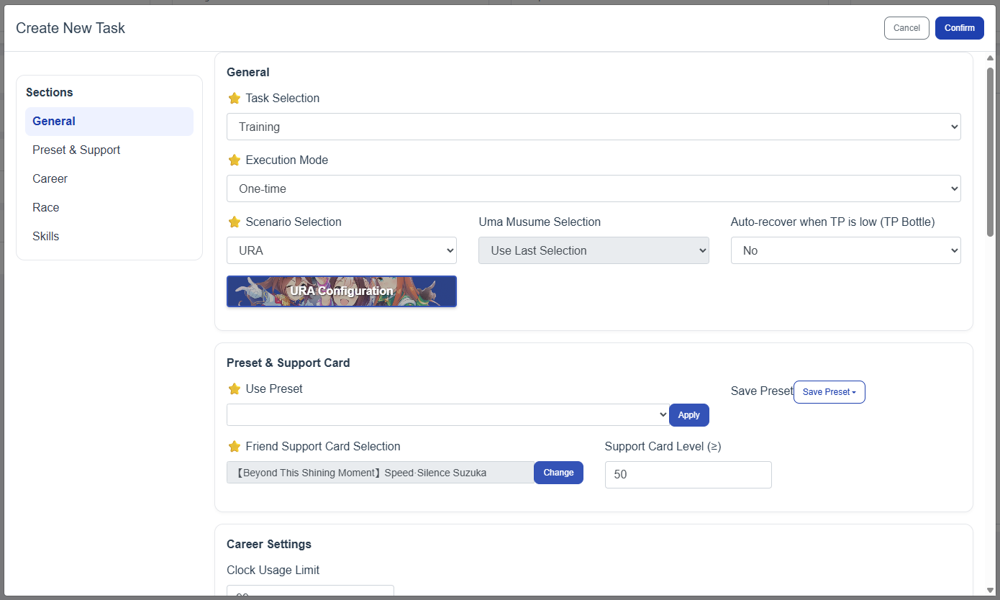
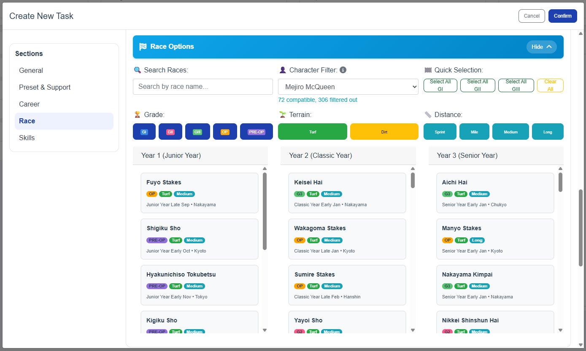
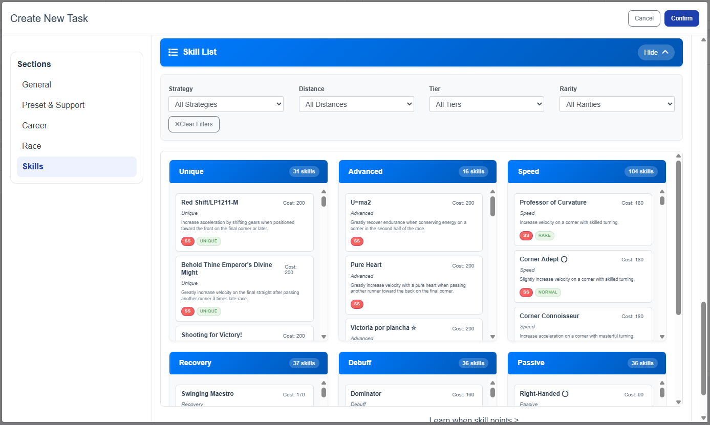

# ⚠️🚨 !!ATTENTION!! 🚨⚠️  
### THE ORGINAL CREATOR IS MISISNG IN ACTION  

unfortunately I too will no longer have time to work on this so hopefullt he returns soon

⏰ On **September 30th 2025 onwards** I will no longer have time to work on this.  
I will do what I can to iron out everything before then.  
But when a new scenario shows up (Make a new track, grand live ect ect), I need **YOUR** help to make a **fork** to deal with that.  

I will be relying on you guys to automate the future senarios. 🙏


# 🏇 Umamusume Auto Trainer (Global Server Edition)

**Uma Musume Pretty Derby Global Server Automatic Career Tool**

> **From China server automation to global server compatibility** - A complete transformation with enhanced features, improved UI, and robust automation capabilities.
>
> ***This project is for educational purpose only, [use it at your own risk](https://umamusume.com/news/100029/)***


## 📄 **License & Credits**

This project is a **Global Server adaptation** of the original China Server version by [@shiokaze](https://github.com/shiokaze/UmamusumeAutoTrainer).

### **Original Project**
- **Original Author**: [@shiokaze](https://github.com/shiokaze/UmamusumeAutoTrainer)
- **Original Repository**: [UmamusumeAutoTrainer](https://github.com/shiokaze/UmamusumeAutoTrainer) (China Server)

### **This Project**
- **Global Server Adaptation**: [UAT-Global-Server](https://github.com/BrayAlter/UAT-Global-Server)
- **Based on**: Original China Server version
- **Enhancements**: 70% translation, improved UI, Global Server compatibility

**Please respect the original author's work while contributing improvements.**


---
## 🚀 **Features**

### **Core Automation**
- ✅ **Automatic Training**: Complete training scenarios for ALL Uma Musume  
  - This includes the handling of:  
    - **Custom races** 
    - **Skill acquisition**
    - **Claw machine**
    - **Running styles** 
    - **Alarm clock usage** 
    - **Building friendship and rainbow trainings** 
    - **Optimal event choices (Knows when to build friendship/recover energy)** 
    - **Pretty much everything you need to do in a career run**

- ✅ **Completely hands off**: Recover tp, Starting runs, finding the right guest card
  - Everything is automated you can just afk until legacy umas are full (fixing "Its a new day" tonight)


- ✅ **Saving of presets**: Save training parameters for easy access in future runs 

## 📦 **Installation & Setup**

### **Option 1: Download Release (Recommended)**
1. Go to [Releases](https://github.com/BrayAlter/UAT-Global-Server/releases)
2. Download the latest release zip file
3. Extract and run `UmamusumeAutoTrainer.exe`

### **Option 2: Build from Source**

#### **Clone Repository**
```bash
git clone https://github.com/BrayAlter/UAT-Global-Server.git
cd UAT-Global-Server
```

#### **Install Dependencies**
1. Install Python 3.10.9: [Download Link](https://www.python.org/downloads/release/python-3109/)
2. Run `install.ps1` (Right-click → "Run with PowerShell")
3. Ensure no `venv` folder exists in current directory

### **Emulator Setup**
- **Resolution**: 720 × 1280 (Portrait mode)
- **DPI**: 180
- **Graphics**: Standard (not Simple)
- **ADB**: Must be enabled in emulator settings
- **IMPORTANT**: Open umamusume app before launch

### **Launch**
```bash
# Run the application
./run.ps1
```

The application will automatically:
1. 🔍 **Scan for ADB devices**
2. 📱 **Show available devices**
3. 🎮 **Detect devices with Umamusume running**
4. ✅ **Let you select your preferred device**
5. ⚙️ **Auto-update configuration**
6. 🚀 **Start the web interface**

#### **Preflight Health Checks**
- Verifies ADB connectivity and device responsiveness before starting the bot
- Validates screenshot stream quality to avoid running on corrupted/static images
- Surfaces clear, English error messages for quick diagnosis

**Success indicator:**
```
🚀 UAT running on http://127.0.0.1:8071
```

Access the web interface at `http://127.0.0.1:8071` to configure and start tasks.



### **Race Selection Interface**


### **Skill Selection Interface**


## ⚠️ **Important Notes**

### **Game Settings**
1. **Graphics**: Must be set to "Standard", not "Basic"
2. **Training Setup**: **Manually select** Uma Musume, Legacy, and Support Cards in-game before starting
3. **Support Cards**: Avoid friend cards (no specific outing strategy)
4. **Starting Position**: Be at Career Menu (where the UI Shows Training, Race, Recreation) 

### **Website Settings RECOMMENDED**
- **Attribute Setting**: Set desired target attributes in the UI. If unsure, do a manual run first and copy the resulting attributes into the UAT interface.
- **Race Selection**: Configure your race schedule to avoid failing fan-count goals. Use the Smart Character Filter; it preserves selections when changing characters and can keep only compatible races.
- **Skill Optimization**: Configure desired skills. Priority `0` means the bot will purchase those skills first.
- **Manual Skill Purchase**: Enable to select end-of-career skills manually while keeping auto-learning during training.

## 🔧 **Troubleshooting**

### **Common Issues**

#### **Fan Goals Fail**
- **Failed to the next goal races because lack of Fans**: Configure the race selection first in the UAT website to avoid lack of Fans

#### **ADB Device Detection**
- **No devices found**: Ensure emulator is running and ADB is enabled and open the umamusume app
- **ADB server issues**: The app automatically restarts ADB server if needed
- **Device not detected**: Check emulator's ADB settings

#### **PowerShell Script Issues**
- **Script crashes**: Open console first to see error messages
- **Execution policy**: Reference: [PowerShell Execution Policy](https://www.jianshu.com/p/4eaad2163567)

#### **Connection Problems**
- **ADB connection fails**: Close accelerators, kill adb.exe, restart emulator
- **Recognition errors**: Manual operation to next turn, reset task in WebUI

#### **Web Interface Issues**
- **Module loading fails**: Ensure proper file permissions and paths

### **Error Recovery**
1. **Stuck interfaces**: Take screenshot, attach error logs
2. **Recognition failures**: Manual intervention, then restart
3. **Connection resets**: Restart both emulator and script


## 🤝 **Contributing**

We welcome contributions! If you find issues or have improvements:

1. **Fork the repository**
2. **Create a feature branch**
3. **Make your changes**
4. **Submit a pull request**

### **Development Setup**
```bash
# Install development dependencies
pip install -r requirements.txt

# Run in development mode
python main.py
```

---
